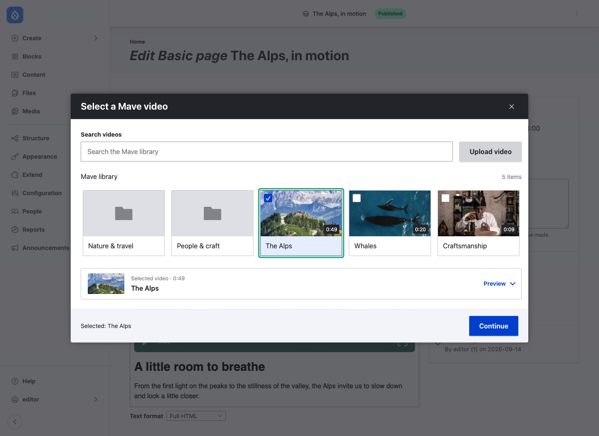
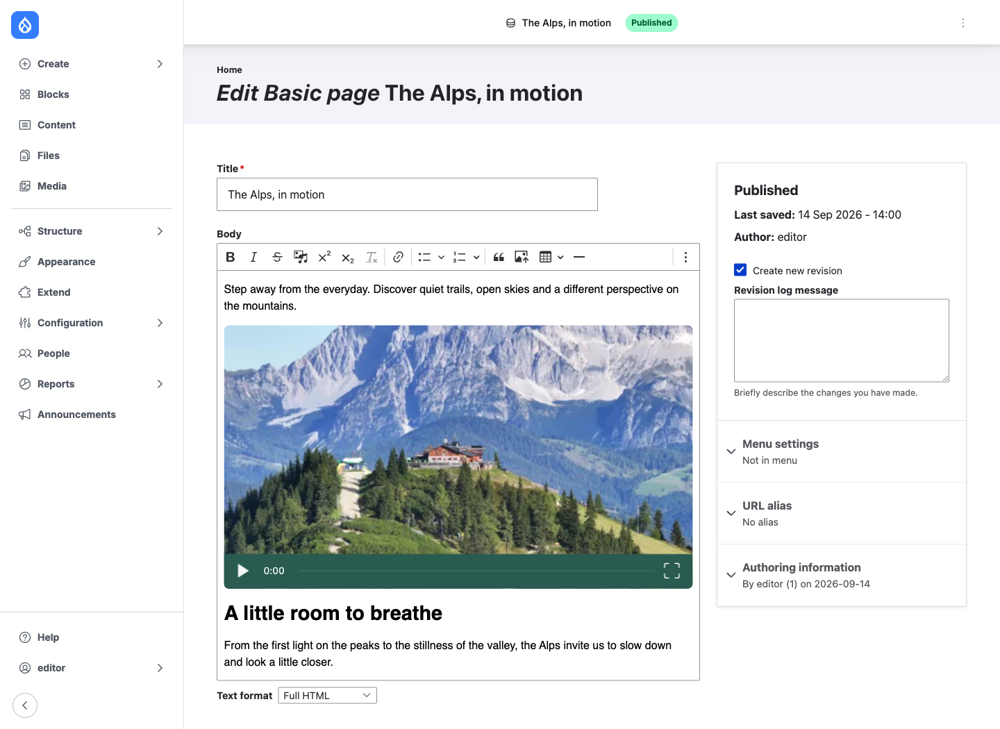

<a href="https://mave.io">
  <picture>
    <source media="(prefers-color-scheme: dark)" srcset="docs/images/mave-logo-white.svg">
    
  </picture>
</a>

# Mave for Drupal

### Your video library, inside Drupal.

Browse, upload and embed Mave videos through Drupal Media Library and CKEditor 5.
Videos stay in Mave; Drupal stores the references you choose for your content.

[Get started](#get-started) · [Configuration](docs/configuration.md) ·
[Contribute](CONTRIBUTING.md)

## From library to page

- **Browse:** folders first, library search and video previews.
- **Upload:** send videos directly to Mave with upload and processing progress.
- **Publish:** insert videos through Media Library, with previews in CKEditor 5.
- **Customize:** set a player theme and color globally or per video.

<table>
  <tr>
    <td width="50%">
      <strong>Browse and select videos</strong><br>
      <a href="docs/images/drupal-library.png"></a>
    </td>
    <td width="50%">
      <strong>Preview inside CKEditor</strong><br>
      <a href="docs/images/drupal-editor.png"></a>
    </td>
  </tr>
</table>

## Get started

Requires Drupal 11, PHP 8.3 or newer, and a Mave installation with an API key.
The module enables its core Media, Media Library and CKEditor 5 dependencies.

Until a Drupal.org release is available, place this directory at
`web/modules/custom/mave`, then run:

```sh
git clone https://github.com/maveio/mave-drupal.git web/modules/custom/mave
drush en mave -y
drush cr
```

1. Open **Configuration → Media → Mave Video** and configure the connection.
2. Grant editors the Mave browse/upload permissions and relevant media permissions.
3. Add **Media Library** to your CKEditor 5 toolbar, enable **Embed media** in the
   text format, and allow the **Mave Video** media type.
4. Choose **Insert Media → Mave Video**, select a video and insert it.

The API key stays on the Drupal server. Browser components, videos and playback
analytics use the configured Mave services. See [configuration and data flow](docs/configuration.md)
for endpoint overrides, key storage and self-hosting.

## Contributing and security

See [CONTRIBUTING.md](CONTRIBUTING.md) for tests and development.
Report vulnerabilities privately as described in [SECURITY.md](SECURITY.md).

## License

Copyright (c) mave.io B.V. [GPL-2.0-or-later](LICENSE.txt).
External components and trademarks retain their own terms; see
[third-party notices](THIRD_PARTY_NOTICES.md).
